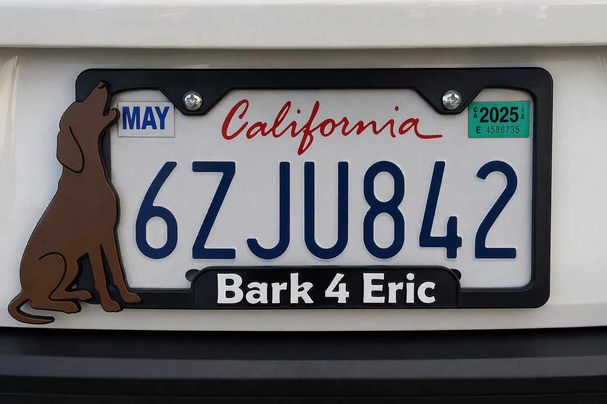

# Bark 4 Eric

## Backstory

Riggs is a Redbone Hound living in Three Rivers, California.

Like most good hounds, he takes his security responsibilities seriously. He routinely alerts on:

- Deer
- Bears
- Strange vehicles
- People approaching the property
- General suspicious activity

A nearby neighbor has expressed strong opinions regarding these alerts.

Rather than debate the issue, this project embraces it.

If Riggs is going to receive credit for every disturbance in the neighborhood, he might as well receive proper recognition.

---

## Design Concept

A howling Redbone Hound silhouette accompanied by the phrase:

Bark 4 Eric

The design is intended as a lighthearted joke inspired by ongoing neighborhood complaints regarding a dog simply doing what dogs do.

---

## Goals

- Create a fun conversation piece
- Practice Fusion 360 design techniques
- Use multi-color 3D printing
- Celebrate Riggs' dedication to home security

---

## Design Elements

- Howling hound silhouette
- Raised text
- Multi-color printing
- Compatible with the shared license plate frame template

---

## Status

Prototype complete and currently undergoing field testing.

Riggs continues to provide quality assurance services.